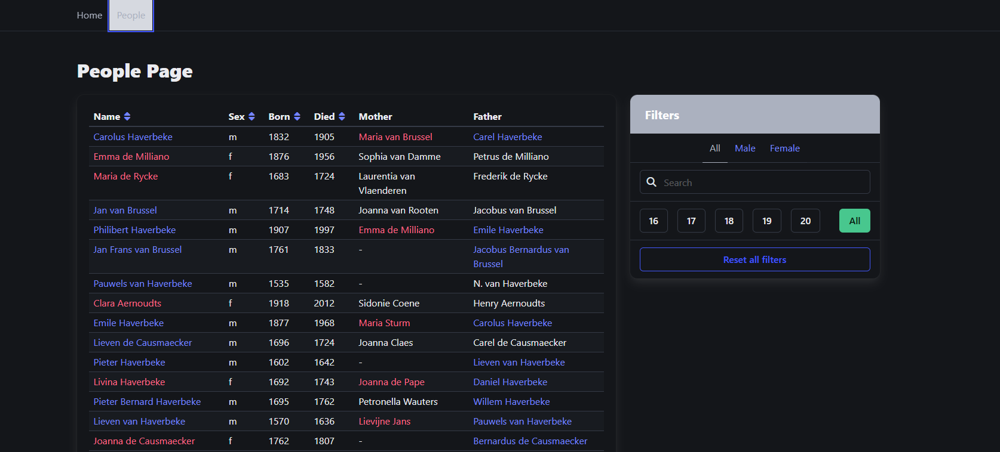

## Overview

### The challenge

Users should be able to:

- Filter and sort people in the table effectively.
- Share the URL containing filters and sorting parameters to show exactly what they see.
- Use interactive sorting on columns such as name, sex, born, and died.
- Filter by Name: Updates the query search parameter with case-insensitive text from the input. Only displays people whose name, motherName, or fatherName match the query. The query is removed if the input is empty.
- Sorting:
Clicking on a column header sorts the data in ascending order (A -> Z or 0 -> 9).
Clicking again reverses the order to descending.
A third click disables sorting and removes the sort and order search parameters.
Sorting parameters are stored using sort (for the field) and order (with desc for descending).
- URL Search Params: All filter and sorting parameters are stored in the URL to facilitate sharing and navigation persistence.

### Screenshot

### Links

- [Solution URL](https://github.com/Ostkreuzzz/BikeNow)
- [Live Site URL](https://ostkreuzzz.github.io/BikeNow/)

## My process

### Built with

- Semantic HTML5 markup
- CSS3: Grid, Flexbox
- BEM methodology: [BEM](https://en.bem.info/methodology/)
- Preprocessors: [Sass](https://sass-lang.com)
- Mobile-first workflow
- AOS library for animations

### What I learned

- Learned how to apply grid to the hole page
- How to structure my code by separating everything into its own file
- How to use most of the features of SASS (cycles, functions, mixins, etc.)

## Author

- Github - [Ostkreuzzz](https://github.com/superpooperxxx)
- LinkedIn - [Mykhailo Sulima](https://www.linkedin.com/in/mykhailo-sulima-a80648339/)
- Telegram - [@Ostkreuz](https://t.me/Ostkreuz)
